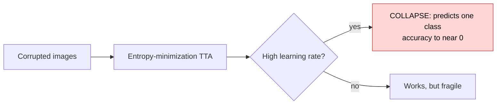
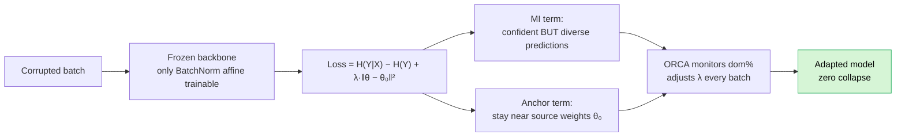
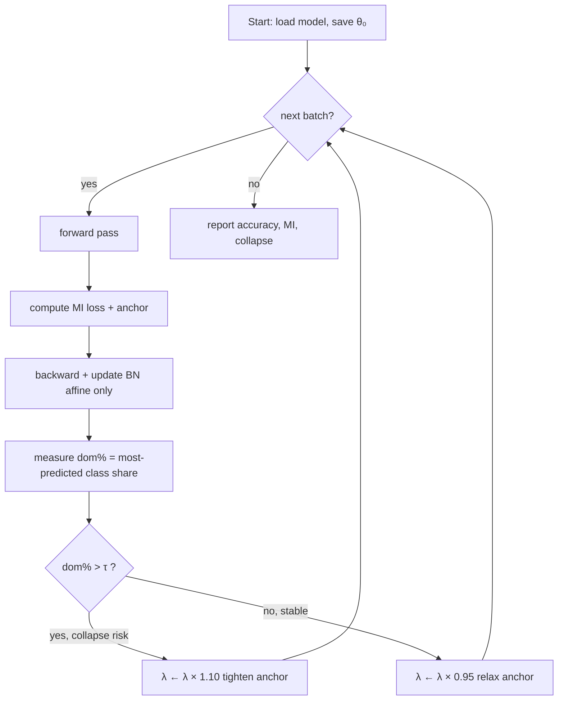
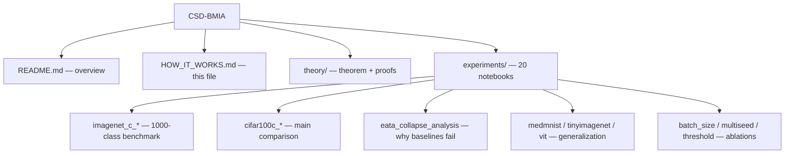

# How CSD-BMIA Works

A one-glance guide to what this project does and how the code fits together.

---

## The problem in one line

When a trained model meets corrupted images (noise, blur, weather…), popular
test-time adaptation methods **collapse** — they start predicting the *same
class* for everything and accuracy crashes.

---

## Our idea: maximize Mutual Information instead of minimizing entropy

Collapse is the *global minimum* of entropy. It is **not** a minimum of Mutual
Information — MI stays a full `log K` away from collapse. So an MI objective can
never be pulled into collapse.

---

## The adaptation loop (what runs each batch)

**In plain words:**
1. Freeze the whole network except the BatchNorm scale/shift parameters.
2. For each incoming batch, nudge those parameters to **maximize mutual
   information** — predictions become confident *and* spread across classes.
3. An **anchor** keeps the parameters close to the original model.
4. **ORCA** watches how concentrated the predictions are and tightens or
   relaxes the anchor automatically — no manual tuning.
5. Result: the model adapts to the corruption **without ever collapsing**.

---

## What's in this repository

Each notebook is self-contained: **Cell 1** installs dependencies, **Cell 2**
runs the experiment and prints a results table.

---

## The one-sentence takeaway

> Replace entropy minimization with **mutual-information maximization + an
> adaptive anchor**, and test-time adaptation becomes **collapse-free** — even
> at high learning rates and small batches where every other method breaks.

Author: **Anish Kumar Thakur** — Alumni 2025, Dept. of CSE, ABV-IIITM (2026).
